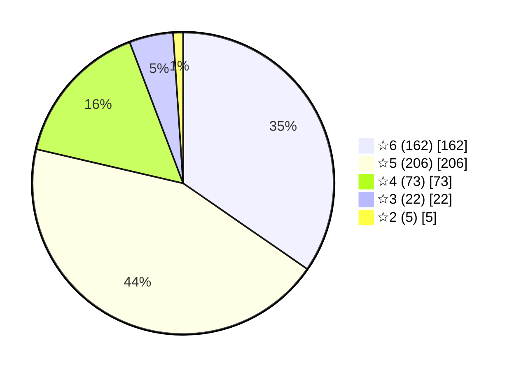

# Arknights AI Skill — 明日方舟角色AI技能设定

基于[ArknightsGameData](https://github.com/Kengxxiao/ArknightsGameData)游戏数据，自动提取并生成明日方舟全角色的 AI 角色扮演技能设定。每个角色包含完整的性格特征、说话风格、价值观、知识领域、人际关系等数据，可直接用于 AI 角色扮演 / SillyTavern / Character Card 等场景。

---

## 📊 数据总览

| 项目 | 数量 |
|------|------|
| 角色总数 | **468** |
| 手动精调角色 | **~65** |
| 自动推断角色 | **~400** |

### 稀有度分布



### 职业分布

| 职业 | 数量 | 说明 |
|------|------|------|
| 🗡️ 近卫 | 77 | 前线近战输出 |
| 🎯 狙击 | 55 | 远程物理输出 |
| ✨ 术师 | 57 | 源石技艺输出 |
| 🛡️ 重装 | 47 | 防御与阻挡 |
| 💚 医疗 | 37 | 治疗与支援 |
| 🚩 先锋 | 41 | 开局部署/费用回复 |
| 🔧 辅助 | 42 | 控制与增益 |
| 🎭 特种 | 43 | 特殊战术执行 |
| 🔩 TOKEN | 69 | 召唤物/机械 |

---

## 📁 文件格式

每个角色一个独立 JSON 文件，命名格式为 `{名称}_{角色ID}.json`。

### 数据结构

```
{
  "character": {           // 基本信息
    "name": "阿米娅",       // 角色名
    "race": "卡特斯/奇美拉", // 种族
    "profession": "术师",   // 职业
    "nation": "罗德岛",     // 所属势力
    "rarity": "☆5",        // 稀有度
    "birthplace": "雷姆必拓",
    "height": "150cm",
    "infection_status": "...",
    "physical_ratings": {}, // 物理/法术评级
    "background_summary": "" // 档案背景摘要
  },
  "personality": {         // 性格设定 ★核心★
    "traits": [],          // 性格特征列表
    "emotional_tendency": "", // 情感倾向描述
    "speech_style": "",    // 说话风格
    "values": []           // 价值观
  },
  "voice_analysis": {      // 语音分析
    "total_lines": 110,    // 台词总数
    "avg_line_length": 34.7, // 平均台词长度
    "key_themes": [],      // 关键话题
    "sample_lines": []     // 样本台词
  },
  "gameplay": {            // 游戏数据
    "base_skills": [],     // 基建技能
    "combat_experience": ""
  },
  "knowledge": {           // 知识领域
    "domains": [],
    "expertise": ""
  },
  "relationships": {       // 人物关系
    "博士": {
      "description": "罗德岛指挥者",
      "source": "语音"
    }
  },
  "usage_guidelines": {    // AI使用指引
    "tone": "",
    "vocabulary": "",
    "response_style": "",
    "special_behaviors": []
  },
  "significance": "high"   // 重要度: high/medium/normal
}
```

### 示例：阿米娅

> **性格特征**：坚强勇敢、温柔善良、有领袖气质、责任担当、对博士依赖
>
> **情感倾向**：外表坚强但内心柔软，对博士有特殊依赖，面对困境绝不退缩
>
> **说话风格**：认真而温和，时而带有少女的青涩，时而展现出超龄的成熟
>
> **价值观**：感染者的未来、守护罗德岛、追随博士的信念

---

## 🎭 手动精调角色

以下关键角色的性格设定经过手动编写，确保与游戏原作高度一致：

| 分区 | 角色 |
|------|------|
| **罗德岛核心** | 阿米娅、凯尔希、W、迷迭香、Mon3tr |
| **企鹅物流** | 德克萨斯、能天使、空、莫斯提马 |
| **喀兰贸易** | 银灰、初雪 |
| **龙门** | 陈、星熊（暂缺） |
| **莱茵生命** | 塞雷娅、伊芙利特、缪尔赛思、多萝西、白面鸮、赫默（暂缺） |
| **深海猎人** | 斯卡蒂、幽灵鲨 |
| **卡西米尔** | 临光、远牙、玛恩纳、斥罪 |  
| **岁兽碎片** | 年、夕、令 |
| **黑钢国际** | 雷蛇、芙兰卡 |
| **拉特兰** | 送葬人 |
| **伊比利亚** | 棘刺、艾丽妮 |
| **维多利亚** | 推进之王、风笛、因陀罗 |
| **乌萨斯** | 凛冬 |
| **萨尔贡** | 异客 |
| **东国** | 嵯峨 |
| **其他** | 艾雅法拉、赫拉格、斯卡蒂、华法琳、红、闪灵、黑、拉普兰德、安洁莉娜、刻俄柏、苏苏洛、安比尔、格劳克斯、月禾、贾维、伊桑、澄闪、贝娜、泡泡、薄绿、黑键、左乐、逻各斯、阿斯卡纶、霍尔海雅等 |

---

## 🔧 生成原理

```
ArknightsGameData
    │
    ├── character_table.json    ─→ 基础属性、职业、稀有度、标签
    ├── handbook_info_table.json ─→ 档案文本、物理评级、背景故事
    ├── charword_table.json     ─→ 语音台词（17,785条）
    ├── building_data.json      ─→ 基建技能描述
    └── handbookline_table.json ─→ 人物关系图谱
            │
            ▼
     generate_aiskills.py
            │
            ├── 手动精调（~65 个关键角色）
            │     └── 基于游戏剧情&设定编写
            │
            ├── 自动推断（~400 个角色）
            │     ├── 关键词匹配（档案 + 语音）
            │     ├── 种族特征注入
            │     ├── 语音模式分析
            │     └── 职业默认兜底
            │
            ▼
    arknights-skill/*.json
```

### 性格推断算法

1. **语音分析**（权重 ×2）：从语音台词中提取情感关键词
2. **档案分析**（权重 ×1）：从档案资料的个性描述中提取特征
3. **种族提示**：基于种族特征注入文化背景特征
4. **职业兜底**：当数据不足时，根据职业类型提供默认性格

---

## 🚀 使用场景

- **SillyTavern / AI Roleplay**：直接导入 `.json` 文件作为角色卡
- **Character Card 生成**：提取 `personality` + `voice_analysis` 构建 Character Card
- **AI 聊天机器人**：使用 `usage_guidelines` 设定 AI 回复风格
- **数据分析**：用于明日方舟角色社会学研究
- **同人创作**：作为角色性格参考

---

## 📝 注意事项

- 数据来源于游戏客户端解包，版权归 Hypergryph / Yostar 所有
- 性格设定中，手动精调部分基于游戏剧情理解，自动推断部分仅供参考
- TOKEN（召唤物/机械）角色的性格设定较为简单
- 部分角色可能缺少档案或语音数据，使用了职业默认值

---

## 📂 目录结构

```
arknights-skill/
├── README.md                          # 本文件
├── index.json                         # 角色索引（按稀有度排序）
├── 阿米娅_char_002_amiya.json          # 角色文件 × 468
├── 凯尔希_char_003_kalts.json
├── ...
└── 阿消_char_277_sqrrel.json
```

---

## 📄 许可

游戏数据版权归 Hypergryph / Yostar 所有。本项目仅用于学术研究和同人创作目的。
